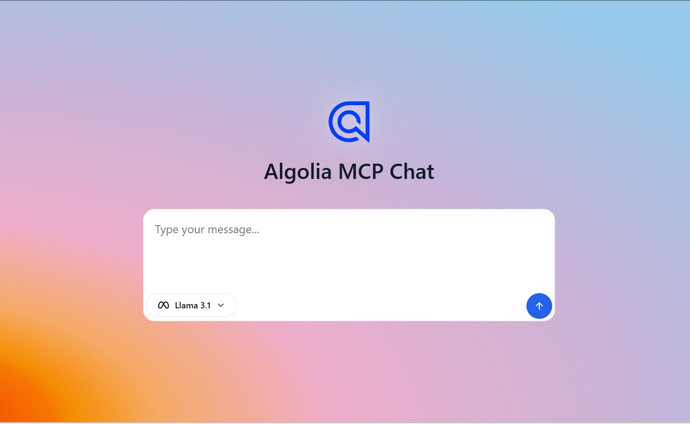

# Algolia MCP Chat

Algolia MCP Chat is a centralized chat application that allows you to interact with and query your Algolia data using the [Algolia Model Context Protocol (MCP)](https://github.com/algolia/mcp-node.git). This app provides a conversational interface to search indices, retrieve analytics, manage index settings, and access user/application information—all powered by Algolia MCP tools and LLMs.


## Features

- **Conversational Search:** Query your Algolia indices using natural language.
- **Analytics Insights:** Get top searches, hit rates, and other analytics data.
- **Index Management:** Access and manage index settings.
- **User & Application Info:** Retrieve user and application details.
- **LLM-Powered Responses:** Uses Groq Llama 3 for natural, helpful answers.
- **MCP Tool Integration:** Leverages Algolia MCP tools for real-time data access.


## Getting Started

### Prerequisites

- [Node.js](https://nodejs.org/) (v18+ recommended)
- [Git](https://git-scm.com/)
- Access to [Algolia MCP Node](https://github.com/algolia/mcp-node.git) repository

### Installation

1. **Clone this repository:**
   ```sh
   git clone https://github.com/abhinavthedev/algolia-mcp-chat.git
   cd algolia-mcp-chat
   ```

2. **Install dependencies for both backend and frontend:**
   ```sh
   cd backend
   npm install
   cd ../frontend
   npm install
   ```

3. **Clone the Algolia MCP Node repository:**
   ```sh
   git clone https://github.com/algolia/mcp-node.git
   ```
   > **Important:**  
   You must copy the path to the `src/app.ts` file from the cloned `mcp-node` repo.  
   This path is required for MCP tool integration in your `.env` file.

4. **Configure Environment Variables:**

   - Copy `.env.example` to `.env` in the `backend` folder.
   - Edit `.env` and set the following:
     - `GROQ_API_KEY` – Your Groq API key
     - `ALGOLIA_APP_ID` – Your Algolia App ID
     - `ALGOLIA_API_KEY` – Your Algolia API Key
     - `ALGOLIA_INDEX_NAME` – Your Algolia index name
     - `ALGOLIA_MCP_NODE_PATH` – **Full path to your cloned `mcp-node/src/app.ts` file**

   Example:
   ```env
   GROQ_API_KEY=your_groq_api_key
   ALGOLIA_MCP_NODE_PATH=/absolute/path/to/mcp-node/src/app.ts
   ALGOLIA_APP_ID=your_algolia_app_id
   ALGOLIA_API_KEY=your_algolia_api_key
   ALGOLIA_INDEX_NAME=your_index_name
   ```


## Running the Application

### 1. Start the Backend

```sh
cd backend
npm run dev
```
The backend will start on [http://127.0.0.1:3000](http://127.0.0.1:3000).

### 2. Start the Frontend

```sh
cd frontend
npm run dev
```
The frontend will start on [http://127.0.0.1:5000](http://127.0.0.1:5000).


## Usage

- Open the frontend in your browser.
- Start chatting to search, analyze, or manage your Algolia data.
- Tool calls and results are shown above each AI response for transparency.


## Notes

- **MCP Node Path:**  
  The application requires the path to the `src/app.ts` file from the [algolia/mcp-node](https://github.com/algolia/mcp-node.git) repo.  
  Make sure you clone that repo and set the correct path in your `.env` file.

- **Security:**  
  Do not expose your API keys or sensitive data in public repositories.

- **For development only:**  
  CORS is enabled for all origins. Adjust for production use.


## License

MIT


## Author

[Abhinav](https://github.com/abhinavthedev)